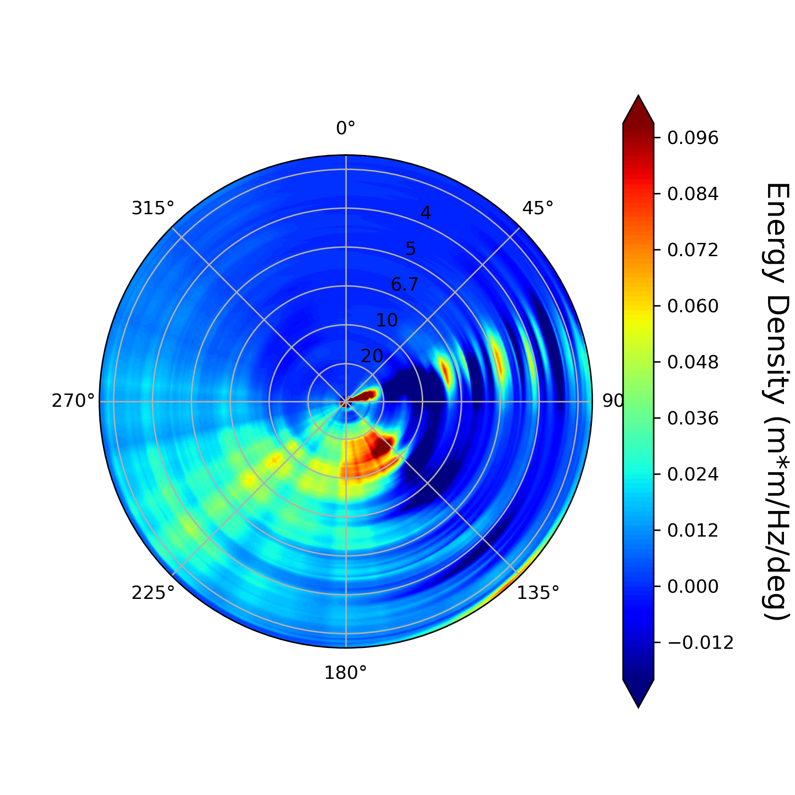

# spectral_analysis
///////////////////////////////////
/////Spectral Analysis Project/////
///////////////////////////////////

This project is all done within Python's JupyterLab environment.

    

//Data//
    The data folder is used for housing downloaded data.
    The data includes .nc files from the CDIP website, .csv files holding values from THREDDS, and .npz files holding values from THREDDS

//Example_scripts//
    The example scripts folder houses many secondary scripts that are works in progress or are not particularly useful.

    fetch_cdip_directional_example
        This script takes the x,y,z variables from THREDDS and saves them in a .npz file (or optionally a .csv).
        This file will be called for script xyz_spectrum.
        * Saving data is not useful if you are pulling for data straight from THREDDS and using it in the same script, skip the middle-man

    Realtime_test
        This script is used for testing of the CDIP realtime dataset

//Scripts//
    The scripts folder houses the main, completed scripts.

    xyz_spectrum
        This script takes data from saved values and makes 1d plots of x,y,z.
        * The script takes saved x,y,z values from a .npz file 
        * This script is used with fetch_cdip_directional_example, as this is how you will obtain your variables

    1d_comparison  
        This script goes into further detail in the comparison between our calculations and their precalculated cdip data.
        Comparisons are made to see how close our calculations are to their calculations.

    Spec_function_final
        Formulas used in this script are pulled from utils.py        
        Calculations are made for the Fourier coefficients and plotted.
        The energy density we find is made into a polar plot. and is compared against the cdip plot.
        * Note: Currently the plot of energy density does not line up with CDIP website, WIP
